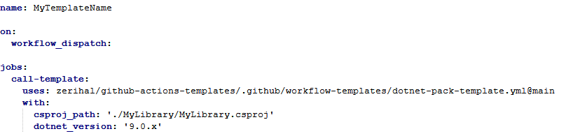

# Workflow-Templates
Collection of useful workflow templates

To call a template, create a new workflow template with the following:
- Replace dotnet-release-pack-template.yml with others from this repo if applicable
- Replace csproj_path value with that of the csproj file to build and package
- Change dotnet_version value if different

