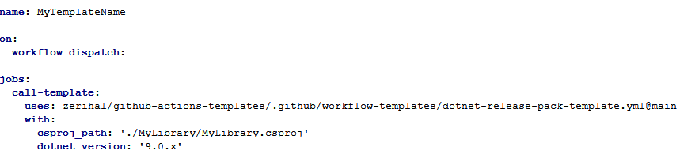

# Workflow-Templates
Collection of useful workflow templates

To call a template, create a new workflow template with the following (replace csproj_path value with the csproj file to be built and published as a nuget package and dotnet-pack-template.yml with the workflow template to use if different):

